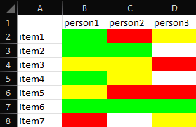

# decision-maker
## Overview
Given a file of preferences and a list of names, display the best items according to their preferences.

## File Format
The program can currently use both Excel (.xlsx) and database (.db) files. 
### Excel
An Excel (.xlsx) file should start with A1 being blank. The rest of the A row is a list of names. The first column is a list of items. Their intersections are colored cells: red (FF0000) for disliking the item, yellow (FFFF00) for neutral, white/black (FFFFFF/000000) for no opinion, and green (00FF00) for liking it. Any other colors will cause errors.
The file should look like this:

### Database
A database file should be made using the excel_to_SQL file, but if you want to make your own, the first column should be named "object_name" and type text. Each subsequent column should be the name of each person and type smallint(1). Each row consists of the name of an item and each person's preference of the item in the form of a number. 
The file should look like this:

## TODO
- [ ] Add GUI.
- [x] ~~Change file format to SQL.~~
- [ ] Remove reference to games (generalize to work for all preferences like restaurants).
- [ ] Implement support for comments about each person's preference.
- [ ] Add support for android.
- [ ] Update README.
- [x] ~~Merge SQL branch.~~
- [ ] Add way to make a new database from scratch.

## License
Licensed under GPL V3. See [LICENSE](LICENSE) for more details.
